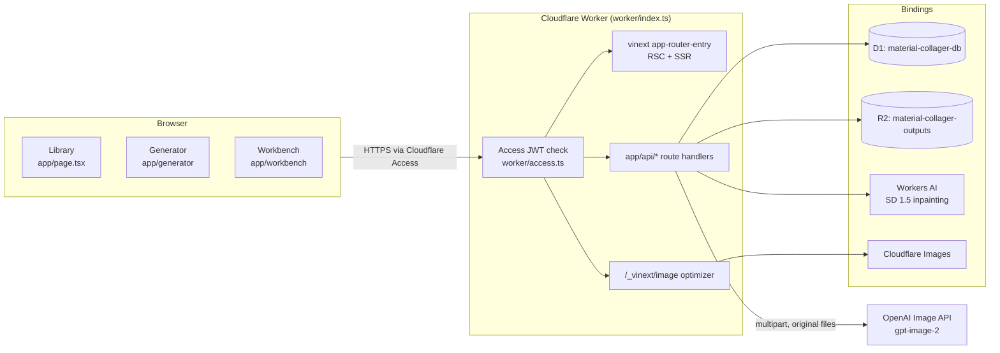
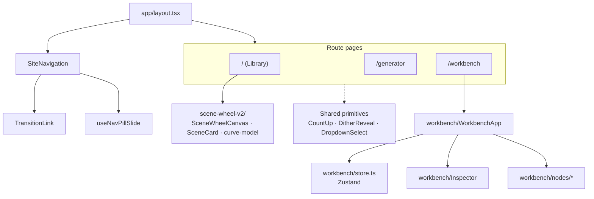
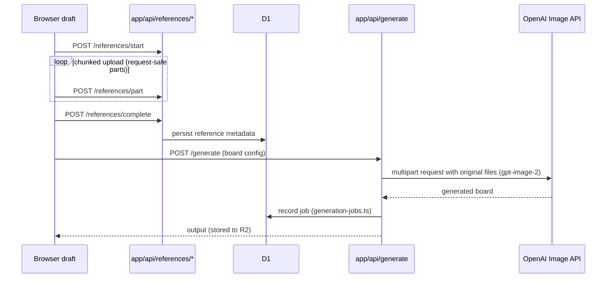

# Architecture

> Generated by `/buddy:docs` (foundation type: react, v1.0.0). For binding fidelity and workflow rules, `AGENTS.md` and `directive/foundation.md` take precedence.

## System Overview

Material Collager is a server-rendered Next.js 16 App Router application compiled by **vinext** (Next-on-Vite) and deployed as a single **Cloudflare Worker**. The Worker fronts everything: static assets, the RSC/SSR render path, image optimization, and the REST API routes. Data lives in Cloudflare D1 (via Drizzle, with lazily-created tables) and generated outputs in R2.

## Routes

| Route | Surface | Notes |
|---|---|---|
| `/` | Library | Landing/library experience; three.js scene |
| `/generator` | Generator | Material-composition workspace |
| `/workbench` | Workbench | Node-based editor (@xyflow/react) |
| `/scene-lab`, `/scene-lab-v2` | Scene Lab | R3F scene development surfaces |
| `/dither-lab` | Dither Lab | Effect development surface |

Route changes between the three main surfaces go through the View Transitions API (`app/components/TransitionLink.tsx` + the plotter-wipe rules in `app/effects.css`), with reduced-motion and no-support fallbacks to plain navigation.

## Component Hierarchy

Feature-based organization: each surface owns its components, hooks, and store.

- **Shared primitives** live at `app/components/` root.
- **Domain logic** lives in `app/lib/` (`collage.ts`, `image-edit.ts`, `image-transport.ts`, `generation-jobs.ts`, `openai-server.ts`, scene-lab geometry/assets/navigation modules).
- **Custom hooks** in `app/hooks/` (`useSceneLabQA`, `useVirtualProgress`) and co-located per feature.

## State Management

- **Workbench**: a single Zustand store at `app/components/workbench/store.ts` (~555 lines) owning the node graph, wire validation (`connectionIsValid`, `portSpecFor`), downstream propagation (`downstreamOf`), draft signatures, and edit-run IDs. Persistence and migration have dedicated tests (`tests/workbench-persistence-migration.test.mjs`).
- **Everything else**: local React state and hooks. Do not introduce parallel stores — see foundation Principle 4.

## Data Flow: Reference → Generation

The core product invariant (foundation Principle 2): original files reach the Image API as actual multipart inputs, never as text descriptions or recompressed blobs.

Request bodies are capped at 32 MB (`next.config.ts` `serverActions.bodySizeLimit`) — sized for a 4K PNG plus compressed references, under the Workers 100 MB cap. Chunking logic lives in `app/lib/image-transport.ts`.

## Rendering Strategy

- **SSR shell** through vinext's RSC environment (`vite.config.ts` configures the `rsc` environment with an `ssr` child).
- **Client-heavy surfaces**: the three main routes are interactive client components.
- **Two rendering systems, chosen per evidence** (foundation Principle 4): DOM + CSS 3D where DOM semantics suffice; React Three Fiber (`scene-lab`, `scene-wheel-v2`) where texture-plane behavior, depth compositing, or camera motion demands WebGL. The choice must be justified in `docs/reference-spec.md`.

## Technology Stack Summary

| Layer | Choice |
|---|---|
| UI | React 19.2, Next.js 16.2 App Router |
| Build | Vite 8 + vinext 0.0.50 + @cloudflare/vite-plugin |
| Language | TypeScript 5.9 strict, `@/*` alias |
| 3D | three 0.182 + @react-three/fiber 9 |
| Node editor | @xyflow/react 12 |
| State | Zustand 5 (workbench) |
| Styling | Tailwind CSS 4 + token CSS (`globals.css`, `effects.css`, `motion-tokens.css`) |
| Data | D1 (Drizzle, lazy tables) + R2 outputs |
| AI | OpenAI `gpt-image-2` (generation/edit), Workers AI SD 1.5 (inpainting) |
| Hosting | Cloudflare Worker behind Cloudflare Access |
| Tests | Node built-in runner (`node --test`), suite per concern |
