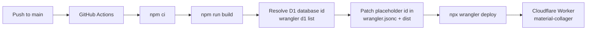

# Deployment

> Generated by `/buddy:docs`. **The authoritative one-time setup guide is [DEPLOYING.md](DEPLOYING.md)** — this page summarizes the pipeline and adds operational context. Where the two differ, `DEPLOYING.md` wins.
>
> Foundation Principle 6 applies: no deployment without explicit approval of the local build, and the completion-report discipline in `AGENTS.md` holds.

## Pipeline

Pushes to `main` (or manual `workflow_dispatch`) run `.github/workflows/deploy.yml`:



Key mechanics:

- **D1 id resolution**: `wrangler.jsonc` ships a placeholder `database_id` (`00000000-0000-4000-8000-000000000000`) so local dev works without account access. The workflow looks up the real id by name (`material-collager-db`) via `wrangler d1 list --json` and patches every file that carries the placeholder before deploying.
- **Secrets**: `CLOUDFLARE_API_TOKEN` and `CLOUDFLARE_ACCOUNT_ID` come from GitHub Actions secrets. Runtime secrets (`OPENAI_API_KEY`, etc.) are Workers secrets, not repo config.
- **Concurrency**: deploys serialize under the `deploy-production` group; in-flight deploys are not cancelled.

## Environments

| Environment | How it runs | Data |
|---|---|---|
| Local | `npm run dev` — Miniflare simulates D1/R2 from `wrangler.jsonc`; secrets from `.dev.vars` | Local simulated bindings |
| Production | Cloudflare Worker `material-collager` | D1 `material-collager-db`, R2 `material-collager-outputs` |

There is no separate staging Worker; `docs/staging-deployment-checklist.md` governs pre-release verification.

## Bindings (wrangler.jsonc)

| Binding | Type | Used by |
|---|---|---|
| `DB` | D1 | Drizzle; tables created lazily by the generation-history service |
| `OUTPUTS` | R2 | Generated board outputs |
| `IMAGES` | Cloudflare Images | `/_vinext/image` optimizer route |
| `AI` | Workers AI | `/api/workbench/inpaint` (SD 1.5 inpainting) |
| `ASSETS` | Static assets | Built client assets |

## Access control

The Worker sits behind **Cloudflare Access** (Zero Trust). Defense in depth: `worker/access.ts` re-verifies the Access JWT on every request so nothing that bypassed the Access proxy on the `workers.dev` domain gets served. `CF_ACCESS_TEAM_DOMAIN` and `CF_ACCESS_AUD` are set in `wrangler.jsonc` `vars`; local dev blanks them in `.dev.vars`.

## Observability

`observability.enabled: true` in `wrangler.jsonc` — Worker logs and metrics are available in the Cloudflare dashboard.

## Release gates

Before calling a release done (see `docs/production-readiness.md` and `docs/release-decisions.md`):

```bash
npm run test:release-readiness
```

```bash
npm run validate:rights
```

```bash
npm run validate:library
```

QA run scaffolding: `npm run qa:scaffold` (creates a release QA run per `docs/device-release-qa.md`).
