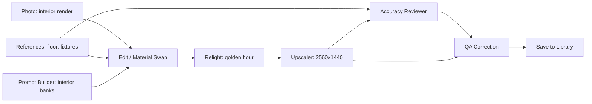

# Workbench: node-based generator page — investigation & design

**Status:** investigation complete, ready for phased implementation.
**Reference product:** Magnific (Freepik) Spaces — a node-graph canvas for AI image workflows.
**Goal:** a second generator page where workflows for **interior render editing**, **exterior render editing**, and **material / appliance / tile collage creation and editing** are built as connected nodes on an infinite canvas, instead of the fixed form of `/generator`.

Everything in this document is grounded in (a) the Magnific Spaces docs, (b) verified OpenAI gpt-image-2 API capabilities, (c) an empirical build-toolchain test in this repo, and (d) a reuse map of the existing codebase. Sources are listed at the end.

---

## 1. What we are borrowing from Magnific Spaces

Spaces (launched as Freepik Spaces, Nov 2025; rebranded Magnific in 2026) is the strongest current example of this UI. The patterns worth copying directly:

- **Typed, color-coded ports.** Connections carry typed data (image, text, …); incompatible ports refuse to connect. Output ports on the right edge, inputs on the left.
- **Three run modes:** *Run Node*, *Run Workflow*, *Run Downstream* — with topological auto-ordering and per-node states (idle / pending / running / done / failed).
- **Cost on the Run button, before running,** updating live as parameters change.
- **Per-node generation history** — re-runs never overwrite earlier outputs; arrows browse variants on the node.
- **Spotlight palette:** space-bar / "/" opens a searchable node search; dragging a wire to empty canvas opens the same palette filtered to compatible nodes.
- **Primary params on the node card, advanced params in an inspector panel.**
- **Templates gallery** that clones a pre-built graph into an editable canvas.
- **Utility nodes:** sticky notes, groups (colored containers), list-driven batching.

Deliberately **out of scope** (Spaces features we are not building): real-time multiplayer, video/audio nodes, the embedded Designer editor, "Workflow Apps" packaging.

Notably, Spaces has no dedicated archviz nodes — its Variations "Angles" mode and creative upscaler are what architects use. Our domain-specific nodes (References with product metadata, Accuracy Reviewer, Collage Board) are a genuine differentiator, not a clone.

## 2. Technology decision (verified, not assumed)

**Canvas library: `@xyflow/react` v12 (React Flow).** MIT-licensed, React-19-native, actively maintained; the alternatives are non-starters (Litegraph archived 2025, react-diagrams stagnant, Rete.js plugin-heavy and un-React-idiomatic). Attribution badge is removable free of charge via `proOptions={{ hideAttribution: true }}`.

**This was empirically verified in this exact repo** — important because the app builds with `vinext` 0.0.50 on Vite 8 + `@vitejs/plugin-rsc` + `@cloudflare/vite-plugin`, *not* the standard Next.js compiler:

- `npm install @xyflow/react zustand` — clean with React 19.2.6.
- `vinext build` succeeds; a test `<ReactFlow>` page compiled, typechecked (zero new errors), and served with correct SSR fallback.
- `import "@xyflow/react/dist/style.css"` from a client component passes through the Tailwind v4 PostCSS pipeline untouched and lands in a route-scoped chunk.
- Bundle impact is route-isolated: ~56 kB gz JS + ~2.6 kB gz CSS, loaded lazily only on the new route (for scale: the scene-lab three.js chunk is 866 kB).
- The dependencies are committed on this branch as groundwork.

**State: Zustand** (React Flow uses it internally, so ~0 added bundle). Store owns `nodes`, `edges`, per-node `status`; custom node components use narrow `useShallow` selectors so drags don't re-render every node.

**Route pattern** (copied from `app/page.tsx` / `app/scene-lab-v2/page.tsx`): `app/workbench/page.tsx` is a thin `"use client"` wrapper with `next/dynamic` + `ssr: false` over `app/components/workbench/WorkbenchCanvas.tsx`. Nav links added in the generator header (`app/generator/page.tsx:1691`) and the library chrome (`SceneWheelV2.tsx:151`). Styling: a `.workbench-shell` section in `app/globals.css` for the chrome (matching the "Monochrome Glass" theme — `--mono-*` tokens, 8.4–10.5px uppercase micro-type), CSS module for canvas internals.

## 3. Node catalog

Port types (color-coded): **image** (purple), **text** (blue), **references** (amber — ordered images *plus* product metadata), **report** (green — QA result), **mask** (violet).

### Sources

| Node | Out | Backing | Notes |
|---|---|---|---|
| **Photo** (upload) | image | client | PNG/JPEG/WebP < 50 MB; drag-drop onto canvas creates one; thumbnail on card |
| **Text** | text | client | plain prompt text; supports `@node` mentions interpolated at run time |
| **References** | references | client | ordered product references, each with id/role/brand/finish/notes — the existing generator's item model as a node; multi-input port accepts Photo outputs |
| **Library Pick** | image | `GET /api/library` | pick a prior output from 30-day history |

### Intelligence

| Node | In → Out | Backing | Notes |
|---|---|---|---|
| **AI Assistant** | text + images → text | new `/api/workbench/assist` (Responses API) | prompt refinement, scene description, critique; default `gpt-5.4-mini`, opt-in `gpt-5.6`; optional web_search |
| **Reference Analyzer** | image → text/metadata | existing `/api/references/analyze` as-is | gpt-5-mini structured product identification (brand/finish/notes + searchQuery) |
| **Reference Finder** | text → images | existing `/api/references/matches` + `/import` as-is | web-searched product matches (gpt-5.4-mini + web_search), hydrated + SSRF-guarded import |
| **Prompt Builder** | params → text | client (+ optional `/api/dry-run` variant) | the lighting/composition/density/styling prompt banks from `collage.ts` as dropdowns; per-domain banks (interior/exterior/collage) |

### Generation & transforms — all backed by one new generalized endpoint `/api/workbench/edit`

| Node | In → Out | Notes |
|---|---|---|
| **Image Generation** | text + references (+ optional layout image) → image×n | the workhorse; size preset, quality low/med/high, n 1–4 |
| **Edit / Material Swap** | image + text + references → image | prompt-directed edit; swap a floor material, replace fixtures |
| **Masked Edit** | image + mask + text (+ references) → image | mask painted in a node modal (reuses `createSelectiveEditAssets` canvas machinery); note: gpt-image masking is prompt-guidance, not pixel-exact — UI must say so |
| **Relight** | image + preset/text → image | preset prompt bank (golden hour, overcast, dusk, studio, north light…) over the same edit call |
| **Variations** | image (+ mode) → image×n | `n` 2–10 on one edits call (input tokens charged once); modes: subtle, camera angle, staging, custom |
| **Image Upscaler** | image → image | creative re-render at up to 3840×2160 (the 4K ceiling; >2560×1440 is documented "experimental"); **regenerative, not pixel-faithful** — Magnific's "creative upscale" ethos; streaming partials mandatory at 2K+ (see §5) |

### Review & output

| Node | In → Out | Backing | Notes |
|---|---|---|---|
| **Accuracy Reviewer** | image + references → report | generalized `reviewGeneratedImage` → new `/api/workbench/review` | gpt-5.6 structured review: score, findings, per-item pass/fail + 0–1000-normalized boxes; domain-parameterized prompt (collage vs render) |
| **QA Correction** | image + report + references → image | `/api/workbench/edit` + existing `buildQaCorrection`/mask compositor | the generator's masked-repair loop as a node; enables review→fix cycles on canvas |
| **Collage Board** | references + params → image | existing collage prompt pipeline | the whole current generator distilled to one node: collage type, orientation, hero item |
| **Save to Library** | image → — | existing `persistGenerationOutput` | writes D1+R2 history (`renderKind:"final"` gates library visibility); graph JSON stored in `payload_json` |
| **Compare A/B** | image + image → — | client | slider comparison, terminal node |
| **Note / Group** | — | client | sticky notes; colored group frames (React Flow parent nodes) |

Deferred to Phase 3: **Economy (Batch) Render** node — now *provably* revivable despite the dead Uploads API (see §6).

## 4. Graph model & execution engine

### Data model

```ts
type PortKind = "image" | "text" | "references" | "report" | "mask";
type WorkbenchNode = Node<{
  kind: NodeKind;                    // discriminated union per node type
  params: Record<string, unknown>;   // node-specific settings
  status: "idle" | "running" | "done" | "error" | "stale";
  outputs: OutputRef[];              // per-node history, newest first
  pinnedOutput?: number;             // n8n-style pin: freeze this output
  error?: string;
  costEstimate?: number;             // USD, live-updated
}, NodeKind>;
```

Image payloads never live in React state (the hard-won lesson from `/generator`): blobs go in a module-level cache keyed `nodeId:runId`, nodes store **object URLs** only; URLs revoked on re-run/unmount. Thumbnails are downscaled via `createImageBitmap`; full-res only in a detail lightbox.

### Execution (client-orchestrated — a platform requirement, see §6)

- **Executor:** Kahn topological sort over the edge list; independent branches run concurrently (bounded, ~2 parallel paid calls); cycles rejected at connect time via `isValidConnection` (which also enforces port-type compatibility).
- **Run modes:** Run Node (runs its unsatisfied upstream first — Houdini's pull model), Run Downstream, Run All.
- **Memoization (ComfyUI's ancestry-hash pattern):** each run stores a signature = hash(node kind + params + input file fingerprints + **all ancestor signatures**). Unchanged nodes are skipped; parameter edits mark self + downstream **stale** (badged, not auto-cleared). Pinned outputs short-circuit their subtree — pinned state visibly badged (the known n8n footgun is *silent* pins).
- **Cancel:** one `AbortController` per run, wired into every fetch (the `/generator` pattern); per-node cancel between chain steps.
- **Cost badge:** deterministic client-side estimator on every paid node and on the Run button (sum over stale nodes about to run). Output tokens follow the validated formula:

```
q = {low:16, medium:48, high:96}[quality]
L = max(w,h); S = min(w,h)
sa = (2*q*S + L) // (2*L)
tokens = ceil(q * sa * (2_000_000 + w*h) / 4_000_000)
cost   = tokens * $30/1M  (+100 tokens per streamed partial)
```

Cross-checked: 1024² → $0.006/$0.053/$0.211 (low/med/high); 2560×1440 → $0.221 high (matches the generator's hardcoded "Est. $0.21"); 3840×2160 → $0.400 high. Input-image tokens have **no published formula** (gpt-image-2 is always high-fidelity); seed at ~$0.01–0.03/input image and **self-calibrate from `usage.input_tokens_details.image_tokens`** returned on every response — actuals shown on the node after each run.

## 5. Server work

The philosophy: the existing `/api/generate` machinery is ~90% generic; the collage coupling is only in payload validation + prompt building. Extract, don't duplicate.

### New routes (all `runtime = "edge"`, same `{ok,...}` envelope)

1. **`POST /api/workbench/edit`** — generalized image edit. Multipart: `payload` JSON `{prompt, size, quality, n, stream?, domain}` + `image[]` (≤16, <50 MB each, order = prompt reference order) + optional `mask` (<4 MB PNG). Internals extracted from `generate/route.ts` into `app/lib/image-edit.ts`: `createImageEdit` (retry + `isRetryableImageError`), size-fallback to `standardSizeFor`, per-attempt diagnostics, `n` passthrough, `usage` in response. Size validation: divisible by 16, aspect 1:3–3:1, ≤3840 px edge, ≤8,294,400 px.
   **Streaming:** verified supported on edits for gpt-image-2 (`stream: true`, `partial_images: 0–3`, +100 tokens each; the model card's "streaming: not supported" grid refers to chat capabilities). At 2K/4K a render runs 200–250s and idle gateways kill silent connections — so **`partial_images ≥ 1` is mandatory at 2K+**, surfaced as a progressive preview on the node. Implemented as an SSE pass-through variant of the route.
2. **`POST /api/workbench/review`** — the Accuracy Reviewer. `reviewGeneratedImage` (`generate/route.ts:505`) already never inspects collage fields — only `{id, role}` items + ordered images. Extract to `app/lib/accuracy-review.ts` with the prompt's domain line parameterized ("material collage" → "interior render" / "exterior render"). Same strict JSON schema (score, findings, per-item boxes), same `normalizeQaBox`.
3. **`POST /api/workbench/assist`** — thin Responses-API proxy for the AI Assistant node: `{instructions, system?, model?, images?[]}` → text. Models allowlisted (`gpt-5.4-mini` default, `gpt-5.6` opt-in); reuses `resolveOpenAIKey`/`readOpenAIResponse`; 120s timeout like `references/matches`.

### Reused unchanged

`/api/references/analyze`, `/api/references/matches`, `/api/references/import`, `GET /api/library`, `GET /api/library/[id]/image`, `PATCH /api/library/[id]`, `persistGenerationOutput` (workflow outputs slot into the same 30-day D1/R2 history; the graph JSON goes in `payload_json`, workflow template name in `collage_type`).

### Persistence for shared workflows (Phase 3, optional)

A `workflows` D1 table via the repo's canonical mechanism — **runtime idempotent DDL** (`ensureJobStorage` pattern). The drizzle scaffolding in `db/` has zero generated migrations and is not the applied mechanism; don't start a divergence.

## 6. Platform constraints that shaped this design (verified in-repo)

- **The OpenAI Uploads API is dead here** (`POST /v1/uploads` → 500 from this host). Everything runs on direct multipart — which the existing `/api/generate` proves out in production. No node may depend on creating new `file_id`s.
- **Client-orchestrated execution is the only safe shape.** The host (OpenAI site-creator wrapping a Workers-like runtime; `.openai/hosting.json` provisions only D1 + R2) has **no Queues, Durable Objects, or cron** — only `ctx.waitUntil` (~30s post-response). One API call per node run; the browser is the scheduler. A single request surviving ~5 min of fetch-wait is proven, but a server-side multi-node chain would be unresumable if the client disconnects — don't build it.
- **The Economy/Batch path is revivable (Phase 3).** Verified: the Batch API supports gpt-image-2 on `/v1/images/edits` (50% discount, Apr 2026 changelog), and since Feb 2026 the edits endpoint accepts JSON bodies with `images: [{image_url}]` — and `GET /api/library/{id}/image` is **publicly reachable with no auth** (checked: no middleware, no token gates). So a Batch node = stage inputs into R2 → reference them by public URL in the JSONL → poll like the existing economy GET. The dead Uploads API is irrelevant to this path.
- **Edge memory:** base64 inflation is the killer; keep per-node calls (one image round-trip each), never aggregate a whole graph's images into one request.
- **Client persistence:** IndexedDB, reusing the generator's proven **split-blob pattern** (`writeSavedDraft` at `page.tsx:583`): graph JSON as one small record (rewritten freely on every edit), upload blobs under `blob:` keys written once and garbage-collected. New DB name `material-collager-workbench`, multiple named graphs + autosave. Export/import: graph JSON with uploads embedded as data URLs (self-contained, ComfyUI-style shareability without its missing-asset failure mode).

## 7. Template workflows (ship as clonable presets)

**Interior render edit** — the flagship:



**Exterior render edit:** Photo → Edit (facade material swap w/ references) → Relight (sky/time-of-day presets) → Variations (staging/angle, n=4) → Compare A/B → Upscaler → Save.

**Collage create & edit:** References (analyzed + web-matched) → Collage Board → Accuracy Reviewer → QA Correction → Upscaler → Save. This reproduces today's `/generator` pipeline as an editable graph — the migration story for existing users.

## 8. Phased implementation plan

**Phase 0 — groundwork (done on this branch):** `@xyflow/react` + `zustand` installed and build-verified.

**Phase 1 — canvas MVP (the walking skeleton):**
- Extract shared client libs from `generator/page.tsx` (pure module-level code, verified extractable): `app/lib/image-transport.ts`, `app/lib/api-client.ts`, `app/lib/draft-store.ts` (parameterized DB name).
- `/workbench` route + canvas + Zustand store + typed ports + Spotlight add-menu.
- Nodes: Photo, Text, Prompt Builder, Image Generation, Compare, Note.
- `/api/workbench/edit` (non-streaming first) extracted from generate route.
- Executor with topo sort, statuses, cancel, cost badges, ancestry-hash memoization.
- IndexedDB autosave (single graph).
- *Definition of done: interior-edit happy path runs end-to-end on canvas.*

**Phase 2 — the full catalog & the three templates:**
- References node + Analyzer + Finder (reusing existing routes), Library Pick.
- Relight, Variations (n>1 UI), Masked Edit (mask painting modal), Upscaler with SSE partial-image streaming.
- `/api/workbench/review` + Accuracy Reviewer + QA Correction nodes.
- AI Assistant node + `/api/workbench/assist`.
- Per-node output history + pinning; named graphs; export/import; templates gallery with the three domain presets; Save to Library.

**Phase 3 — power features:**
- Economy Batch node (R2 staging + `image_url` JSONL + poll), groups, cost self-calibration from usage actuals, optional shared `workflows` D1 table, List-style batching (run a graph per reference set).

## 9. Risks & honest caveats

1. **Masking is guidance, not geometry.** gpt-image models treat masks as strong hints; edges can drift. The generator already mitigates by client-side compositing protected pixels back (`compositeSelectiveEdit`) — the Masked Edit node inherits this, and the UI must not promise pixel-exact inpainting.
2. **The Upscaler is a re-render.** Identity/detail can drift at 4K, which OpenAI marks experimental; long runs (200–250s) make streaming partials load-bearing, not cosmetic. Cost is real: ~$0.40/run at 4K high.
3. **No transparent backgrounds** on gpt-image-2 — no cut-out/PNG-alpha node.
4. **Input-token pricing is estimated** until calibrated from usage actuals (no published formula).
5. **vinext is young** (0.0.50). The empirical test covered install/typecheck/build/dev-serve; `vinext start` fails on `cloudflare:workers` ESM resolution *pre-existing and unrelated* — production runs through the Workers build. Still: pin the dependency versions.
6. **One canvas, one user.** Multiplayer/collab is explicitly out of scope; IndexedDB graphs are per-browser until the Phase-3 D1 table.

## 10. Sources

- Magnific/Freepik Spaces docs: spaces-overview, getting-started, nodes-and-connections, image-nodes, media/text/utility/designer-nodes; launch posts (businesswire, wireflow).
- OpenAI: images/edits API reference (sizes, `n`, mask, `images[{image_url}]` JSON bodies), image-generation guide (streaming `partial_images`, experimental >2560×1440), Batch guide + Apr 2026 changelog (gpt-image-2 batch support), pricing page, gpt-5.6 / gpt-5.4-mini model pages; community-validated output-token calculator (cross-checked against 3 independent sources).
- xyflow: React Flow v12 release notes, TypeScript/performance/state-management guides, workflow-editor template, attribution/licensing discussions.
- Execution-semantics patterns: ComfyUI caching internals (ancestry-hash signatures), n8n partial-execution + pin-data docs, Houdini cooking model, Blender multi-input sockets.
- In-repo verification: `@xyflow/react` build test under vinext/Vite 8/RSC; platform-primitive audit (`vite.config.ts`, `worker/index.ts`, `.openai/hosting.json`); public reachability check of the R2 image route; D1 schema-mechanism audit (runtime DDL vs unused drizzle scaffolding); API + client reuse maps of `app/api/*` and `app/generator/page.tsx`.
